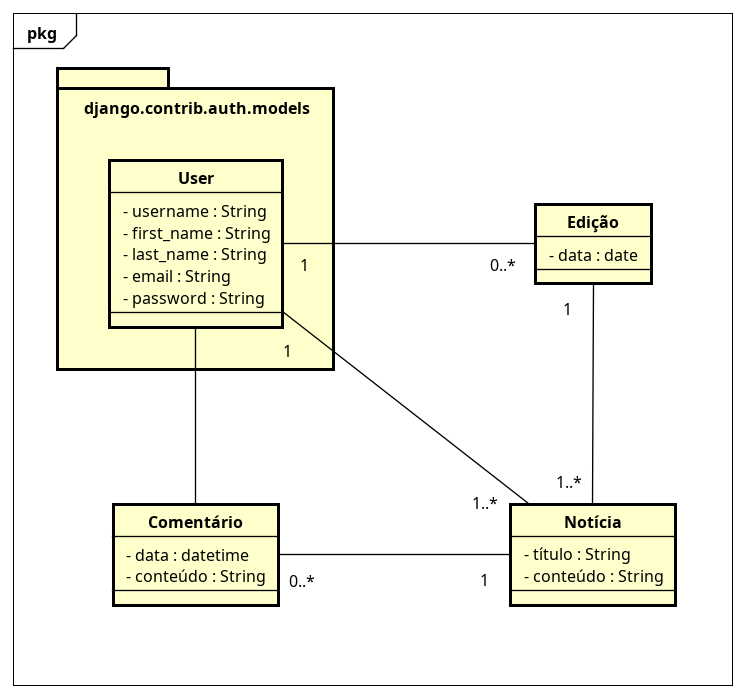

# ConecTADS
Sistema que simula um blog informativo desenvolvido com Django para a disciplina de Desenvolvimento Web do curso de TADS do IFRN-CNAT.

## Objetivos Concluídos

- DIAGRAMA DE DOMÍNIO (para auxiliar no desenvolvimento)
- IMPLEMENTAÇÃO DOS MODELOS
- VALIDAÇÕES A NÍVEL DE MODELO
- REGISTRO DE MODELOS NO PAINEL DO ADMIN
- REGISTRO DE DADOS EM TODOS OS MODELOS
- DUMP DOS DADOS PARA O db.json
- gitignore

## Credenciais Admin

- USER: ```admin```
- PASSWORD: ```admin```

## Diagrama de Domínio



## Segunda Entrega

### Views

**Feito**

- RegisterView
- LoginView
- Logout View
- IndexView
- EditionView
- NewsView

### Services

**Feito**

- Register
- Edition
- News

### Templates

**Em produção**

- Base
- Regiser
- Login
- Index
- Edition

**A fazer**

- Criar notícia
- Ver notícia
- Criar comentário / sessão de comentários
